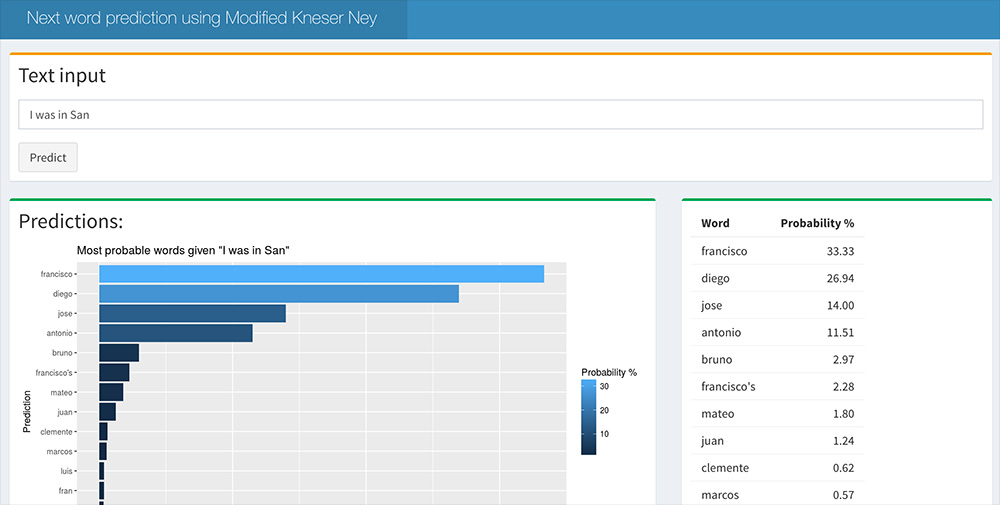

## Context


Many of us use next word prediction each day - most commonly on our mobile phones. These tools can help improve speed of typing and improve spelling accuracy. 


<div style="width: 35%; float: left; padding-right:5%">

<p>The aim of this project is to produce an application that predicts the next word, given the context of the words keyed by the user. The project utilises best practice algorithms to maximise predictive performance.</p>

<p>The application is hosted within the Shiny framework and can be found <a href="http://www.google.com">here</a>.</p>

<p><strong>How does the app work?</strong> The user enters text into the input area, the most probably next words are then shown to the user in descending order.</p>

</div>

<div style="width: 55%; float: left; padding-right:5%">
<p><strong>Image 1: Application</strong></p><p>
</p>
</div>

---

## Data and Processing

```{r, echo=FALSE, message=FALSE, error=FALSE}
intro.results <- data.frame(c("Twitter", "News", "Blogs"), c("159 MB", "196 MB", "200 MB"), c("2.4m", "1.0m", "0.9m"), c("29.5m", "33.5m", "36.9m"), c("397k", "337k", "387k"), c("82.6%", "86.8%", "88.9%"), c("74.3%", "79.5%", "88.5%"))
names(intro.results) <- c("Data", "Size", "Documents", "Words", "Vocabulary", "% Valid English", "% Dictionary coverage")
rownames(intro.results) <- NULL
suppressMessages(library(knitr))
corpus.summary <- kable(intro.results)
return(corpus.summary)
```


The data consists of 1.0m news articles, 0.9m blog articles and 2.4m, tweets and covers the majority of common words in the English Language.

- URLs, email addresses, punctuation have not been included as they do not contribute to model quality.
- Stop words have not been removed as these add value to the prediction model
- Explicit words have been removed to prevent explicit predictions
- All words have been converted to lower case for consistency and to allow a smaller corpus for the same predictive ability
- Unknown words will not be an output of the prediction model however these will be included for performance evaluation
- 9% of the data is used to build the model (a term frequency matrix) and 1% is used for testing

---

## Algorithm


In the task of wanting to predict the next word given some history, we can formulate this problem as the probability of a word $w$ given its history $h$ as $P(w|h)$. The probability is calculated as the relative frequency of the word or permutation of words. $P(w|h) = \frac{P(w, h)}{P(h)}$.

The predictive model is based on an n-gram model. N-grams are one of the most common tools for building language models An n-gram is a sequence of $n$ words for example "Thank you" is a 2-gram or bi-gram, "How are you" is a 3-gram or a tri-gram, and so on, these n-grams are extracted from the training data set.

A smoothing algorithm  is used, so that words not observed in training are still given some probability mass:

<strong>Modified Kneser Ney (Chen and Goodman)</strong>


$$
p_{KN}(w_i|w_{i-n+1}^{i-1}) = \frac{max(c_{KN}(w_{i-n+1}^{i}) - D(w_{i-n+1}^{i-1}), 0)}{c_{KN}(w_{i-n+1}^{i-1})}+\lambda(w_{i-n+1}^{i-1})p_{KN}(w_i|w_{i-n+2}^{i-1})
$$

All count values are stored in seperate `data.table`'s, meaning that counts are pulled in real time rather than calculated - this results in a lengthy build process but results in fast response times for the user.

---

## Performance

$$
\text{Perplexity}(w_1^n) = \exp \left( -\frac{1}{n} \sum_{i=1}^n \ln  P \left( w_i \middle| w^{i-1}_{i-n+1} \right) \right)
$$

Perplexity was used as the main metric for evaluation, it represents the average branching factor - the average number of words that can follow a given word. Perplexity is calculated on a held out test set. 

```{r, echo=FALSE, cache=TRUE, warning=FALSE}

calc.names <- c("MLE - 3gram", "MLE - 2gram", "MLE - 1gram","Modified Kneser Ney - 4gram") 

perplexity.exc.calc <- c(39, 140,  1228, "%")
oov.calc <- c("52%", "19%",  "1%", "%")
perplexity.inc.calc <- c(24322, 1112,  1371, "%")
results <- data.frame(calc.names, perplexity.exc.calc, oov.calc, perplexity.inc.calc)
names(results) <- c("Model", "Perplexity - Exc. OOV", "OOV", "Perplexity - Inc. OOV")
rownames(results) <- NULL 
corpus.summary.a <- kable(results)
return(corpus.summary.a)
```

 
